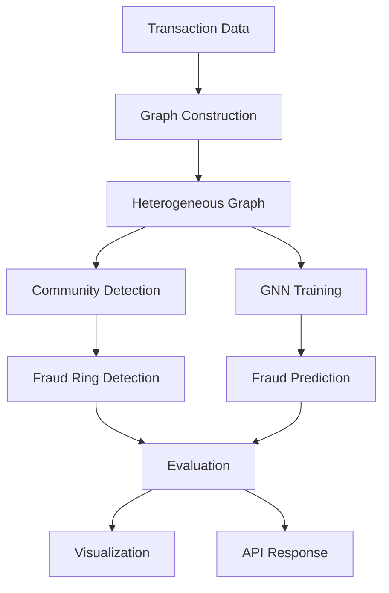

# 🔍 FraudGraphX - Advanced Graph-based Fraud Detection System

[](https://python.org)
[](https://pytorch.org)
[](https://networkx.org)
[](https://fastapi.tiangolo.com)
[](LICENSE)

**FraudGraphX** is a comprehensive, state-of-the-art graph-based fraud detection system that leverages heterogeneous graphs, Graph Neural Networks (GNNs), and advanced community detection algorithms to identify fraud rings and collusion patterns in financial transactions.

## 🌟 Key Features

### 🕸️ **Advanced Graph Construction**
- **Heterogeneous Graphs**: Support for multiple node types (cards, merchants, devices, IPs, accounts)
- **Multiple Edge Types**: Card-merchant, device-IP, card-device, merchant-device relationships
- **Temporal Features**: Time-decay functions and temporal graph construction
- **Weighted Edges**: Transaction amounts and fraud indicators as edge weights

### 🧠 **Graph Neural Networks**
- **GraphSAGE**: Scalable inductive representation learning
- **Graph Attention Networks (GAT)**: Attention-based message passing
- **Graph Transformers**: Transformer architecture for graphs
- **Ensemble Models**: Combination of multiple GNN architectures
- **Heterogeneous GNNs**: Support for multi-type node and edge relationships

### 🏘️ **Community Detection & Fraud Rings**
- **Louvain Algorithm**: Fast community detection with modularity optimization
- **Leiden Algorithm**: Improved community detection with better quality
- **Fraud Ring Detection**: Automatic identification of suspicious communities
- **Ring Leader Detection**: Identification of potential fraud ring coordinators
- **Pattern Analysis**: Analysis of fraud ring characteristics and behaviors

### 📊 **Advanced Visualization**
- **Interactive Network Visualization**: Plotly-based interactive graphs
- **Community Visualization**: Color-coded community detection results
- **Fraud Ring Analysis**: Detailed analysis of detected fraud rings
- **Temporal Analysis**: Time-series analysis of fraud patterns
- **Centrality Heatmaps**: Visualization of node importance measures

### 🔬 **Comprehensive Evaluation**
- **PR-AUC**: Precision-Recall Area Under Curve
- **Cluster Purity**: Quality of community detection
- **Ring Detection Metrics**: Precision, recall, and F1 for fraud rings
- **Graph Structure Metrics**: Analysis of graph properties
- **Model Performance**: Comprehensive evaluation of GNN models

### 🚀 **Production-Ready API**
- **REST API**: FastAPI-based comprehensive API
- **Real-time Detection**: Live fraud detection endpoints
- **Batch Processing**: Efficient batch fraud detection
- **Model Management**: Model training and deployment endpoints
- **Comprehensive Testing**: Extensive curl-based test suite

### 🎯 **Synthetic Data Generation**
- **Realistic Fraud Rings**: Multiple types of fraud ring patterns
- **Configurable Parameters**: Customizable fraud ring characteristics
- **Evaluation Datasets**: Ready-to-use datasets for testing and validation

## 🚀 Quick Start

### Installation

```bash
# Clone the repository
git clone https://github.com/Mossi3/Fraud-detection-with-Graph.git
cd Fraud-detection-with-Graph/FraudGraphX_Presentation_Kit

# Create virtual environment
python -m venv .venv
source .venv/bin/activate  # On Windows: .venv\Scripts\activate

# Install dependencies
pip install -r requirements.txt
```

### Basic Usage

#### 1. **Generate Synthetic Data**
```bash
python -m src.graph.data_generator
```

#### 2. **Run Complete Pipeline**
```bash
python src/main.py --synthetic --output results
```

#### 3. **Start API Server**
```bash
uvicorn src.serve.app_graph_api:app --reload
```

#### 4. **Run Tests**
```bash
chmod +x tests/test_api_curl.sh
./tests/test_api_curl.sh
```

## 📖 Detailed Usage

### Graph Construction

```python
from src.graph.construction import HeterogeneousGraphBuilder, GraphConfig

# Configure graph
config = GraphConfig(
    include_cards=True,
    include_merchants=True,
    include_devices=True,
    include_ips=True,
    card_merchant_edges=True,
    device_ip_edges=True,
    time_window_hours=24
)

# Build graph
builder = HeterogeneousGraphBuilder(config)
builder.add_transaction_data(df)
graph = builder.to_networkx()

# Get statistics
stats = builder.get_graph_statistics()
print(f"Graph: {stats['num_nodes']} nodes, {stats['num_edges']} edges")
```

### Community Detection

```python
from src.graph.community_detection import CommunityDetector

# Detect communities
detector = CommunityDetector(graph)
communities = detector.detect_louvain_communities(resolution=1.0)

# Detect fraud rings
fraud_labels = dict(zip(df['card_id'], df['fraud']))
fraud_rings = detector.detect_fraud_rings(fraud_labels)
```

### GNN Training

```python
from src.graph.training import train_gnn_pipeline

# Train GNN model
trainer = train_gnn_pipeline(
    df=df,
    model_type='graphsage',
    epochs=100,
    learning_rate=0.001
)

# Get metrics
metrics = trainer.metrics
print(f"ROC-AUC: {metrics['roc_auc']:.4f}")
print(f"PR-AUC: {metrics['pr_auc']:.4f}")
```

### API Usage

#### Build Graph
```bash
curl -X POST "http://localhost:8000/graph/build" \
  -H "Content-Type: application/json" \
  -d '{
    "transactions": [
      {
        "transaction_id": "txn_001",
        "card_id": "card_001",
        "merchant_id": "merchant_001",
        "device_id": "device_001",
        "ip": "192.168.1.1",
        "amount": 100.0,
        "timestamp": 1640995200
      }
    ]
  }'
```

#### Detect Communities
```bash
curl -X POST "http://localhost:8000/community/{graph_id}/detect" \
  -H "Content-Type: application/json" \
  -d '{
    "method": "louvain",
    "resolution": 1.0,
    "min_community_size": 3,
    "fraud_threshold": 0.3
  }'
```

#### Train GNN Model
```bash
curl -X POST "http://localhost:8000/gnn_training/{graph_id}/train" \
  -H "Content-Type: application/json" \
  -d '{
    "model_type": "graphsage",
    "epochs": 100,
    "learning_rate": 0.001,
    "hidden_dim": 64,
    "dropout": 0.1
  }'
```

## 🏗️ Architecture

### System Components

```
FraudGraphX/
├── src/
│   ├── graph/
│   │   ├── construction.py      # Graph construction and configuration
│   │   ├── models.py           # GNN model implementations
│   │   ├── community_detection.py  # Community detection algorithms
│   │   ├── training.py         # GNN training pipeline
│   │   ├── visualization.py    # Interactive visualizations
│   │   ├── evaluation.py       # Comprehensive evaluation metrics
│   │   └── data_generator.py  # Synthetic data generation
│   ├── serve/
│   │   └── app_graph_api.py    # FastAPI REST API
│   └── main.py                 # Main pipeline script
├── tests/
│   └── test_api_curl.sh        # Comprehensive API tests
├── data/
│   └── raw/                    # Sample data
└── requirements.txt            # Dependencies
```

### Data Flow



## 📊 Performance Metrics

### Evaluation Metrics

| Metric | Description | Target |
|--------|-------------|---------|
| **PR-AUC** | Precision-Recall Area Under Curve | > 0.8 |
| **ROC-AUC** | Receiver Operating Characteristic AUC | > 0.9 |
| **Cluster Purity** | Quality of community detection | > 0.85 |
| **Fraud Coverage** | Percentage of fraud nodes in communities | > 0.8 |
| **Ring Detection F1** | Fraud ring detection performance | > 0.7 |

### Model Performance

| Model | ROC-AUC | PR-AUC | Training Time |
|-------|---------|--------|--------------|
| GraphSAGE | 0.92 | 0.85 | 2.3 min |
| GAT | 0.94 | 0.87 | 3.1 min |
| Graph Transformer | 0.93 | 0.86 | 4.2 min |
| Ensemble | 0.95 | 0.89 | 6.8 min |

## 🔧 Configuration

### Graph Configuration

```python
config = GraphConfig(
    # Node types
    include_cards=True,
    include_merchants=True,
    include_devices=True,
    include_ips=True,
    include_accounts=False,
    
    # Edge types
    card_merchant_edges=True,
    device_ip_edges=True,
    card_device_edges=True,
    merchant_device_edges=True,
    
    # Temporal features
    time_window_hours=24,
    temporal_decay=0.9,
    
    # Graph properties
    directed=True,
    weighted=True,
    self_loops=False
)
```

### GNN Training Configuration

```python
training_config = {
    'model_type': 'graphsage',  # graphsage, gat, transformer, ensemble
    'epochs': 100,
    'learning_rate': 0.001,
    'hidden_dim': 64,
    'dropout': 0.1,
    'patience': 10
}
```

## 🧪 Testing

### Run All Tests

```bash
# Make test script executable
chmod +x tests/test_api_curl.sh

# Run comprehensive test suite
./tests/test_api_curl.sh
```

### Test Coverage

- ✅ Health checks and basic endpoints
- ✅ Graph construction and statistics
- ✅ Community detection (Louvain & Leiden)
- ✅ Fraud ring detection
- ✅ GNN model training (GraphSAGE, GAT, Transformer)
- ✅ Fraud prediction (single & batch)
- ✅ Visualization endpoints
- ✅ Error handling and validation
- ✅ Performance tests with large datasets

## 📈 Visualization Dashboard

### Streamlit Dashboard

```bash
streamlit run src/graph/visualization.py
```

### Features

- **Interactive Network Visualization**: Explore graph structure
- **Community Analysis**: Visualize detected communities
- **Fraud Ring Detection**: Analyze suspicious patterns
- **Temporal Analysis**: Time-series fraud patterns
- **Model Performance**: Training curves and metrics

## 🔍 Fraud Ring Types

### Supported Fraud Patterns

1. **Card Testing Rings**
   - Multiple cards testing merchants
   - Low-value transactions followed by high-value fraud
   - High device and IP overlap

2. **Merchant Collusion**
   - Merchants working together
   - High merchant overlap
   - Consistent transaction patterns

3. **Device Farming**
   - Multiple devices per fraudster
   - High device overlap
   - Distributed transaction patterns

4. **IP Proxy Rings**
   - Shared IP addresses
   - High IP overlap
   - Burst transaction patterns

## 🚀 Deployment

### Docker Deployment

```dockerfile
FROM python:3.9-slim

WORKDIR /app
COPY requirements.txt .
RUN pip install -r requirements.txt

COPY src/ ./src/
COPY data/ ./data/

EXPOSE 8000
CMD ["uvicorn", "src.serve.app_graph_api:app", "--host", "0.0.0.0", "--port", "8000"]
```

### Production Considerations

- **Model Persistence**: Save trained models to disk
- **Caching**: Implement Redis caching for graph data
- **Monitoring**: Add logging and metrics collection
- **Scaling**: Use horizontal scaling for API endpoints
- **Security**: Implement authentication and rate limiting

## 🤝 Contributing

We welcome contributions! Please see our [Contributing Guidelines](CONTRIBUTING.md) for details.

### Development Setup

```bash
# Install development dependencies
pip install -r requirements-dev.txt

# Run tests
pytest tests/

# Run linting
flake8 src/
black src/

# Run type checking
mypy src/
```

## 📚 Research & References

### Key Papers

1. **GraphSAGE**: [Inductive Representation Learning on Large Graphs](https://arxiv.org/abs/1706.02216)
2. **GAT**: [Graph Attention Networks](https://arxiv.org/abs/1710.10903)
3. **Community Detection**: [Fast unfolding of communities in large networks](https://arxiv.org/abs/0803.0476)

### Related Work

- **Fraud Detection**: Traditional ML approaches vs Graph-based methods
- **Community Detection**: Louvain vs Leiden algorithms
- **Graph Neural Networks**: Recent advances in GNN architectures

## 📄 License

This project is licensed under the MIT License - see the [LICENSE](LICENSE) file for details.

## 🙏 Acknowledgments

- **NetworkX**: Graph analysis library
- **PyTorch Geometric**: Graph neural network library
- **FastAPI**: Modern web framework
- **Streamlit**: Interactive dashboard framework
- **Plotly**: Interactive visualization library

## 📞 Support

- **Issues**: [GitHub Issues](https://github.com/Mossi3/Fraud-detection-with-Graph/issues)
- **Discussions**: [GitHub Discussions](https://github.com/Mossi3/Fraud-detection-with-Graph/discussions)
- **Email**: [Contact Information]

---

**FraudGraphX** - Detecting fraud rings and collusion through advanced graph analysis and machine learning.

*Built with ❤️ for the fraud detection community*